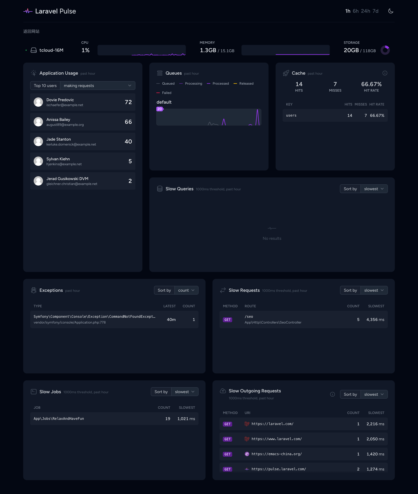

# Laravel Pulse 在线 demo

这是一个 Laravel Pulse 在线 demo 项目，用于体验 Pulse 的各种功能。下面体验地址，最近的一个礼拜内会保持可用：

https://pulse-demo.xuchunyang.cn/pulse

为了测试 pulse 监控的内容，我用到了 cache、queue、http client 等 laravel 的功能。

## pulse 面板截图

从上到下，分别是：

- 服务器的状态 (CPU、内存、磁盘、网络)，如果你用 forge 部署的话，会在后台启动 `php artisan pulse:check` 这样一个 daemon
  进程，定期采集服务器状态。
- 用户使用量，包括请求数、慢请求数、任务数量
- 队列任务的统计数据
- 缓存命中率
- 慢查询
- Exceptions 异常，这个感觉有用，比查看日志方便
- 慢请求
- 慢任务
- 慢 http client 请求
